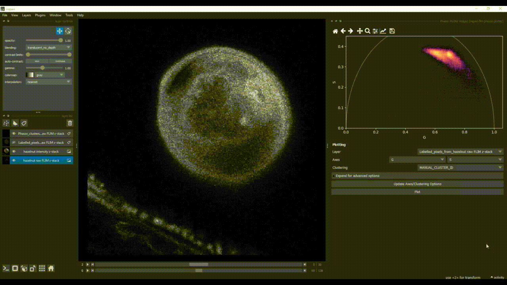

# Phasor Analysis

## Generating Phasor Plots

Call the plugin from the menu `Plugins > FLIM phasor plotter > Calculate Phasors` (or `Layers -> Data -> Phasors -> Calculate Phasors` if napari version >= `0.5.0`) to generate a phasor plot by pixel-wise Fourier transformation of the decay data. Hereby, select the FLIM image to be used (it should be the layer with the raw data), specify the laser pulse frequency (if information is present in the file metadata, this field will be updated after phasor calculation). Choose a harmonic for optimal visualization, define an intensity threshold (here in absoluete values) to exclude pixels of low photon counts, and optionally apply a number of iterations `n` of a 3x3 median filter. If a calibration sample with known lifetime is available, optionally load it as a napari layer and check the apply calibration checkbox to have access to a field to write the lifetime value and apply it. `Run` creates the phasor plot and an additional labels layer in the layer list.

## Phasor Plot Navigation

 Use the toolbar on top of the plot to navigate through the plot. For example, by activating the zoom tool button (magnifying glass icon), you can zoom in (with left click) or out (with right click), just *remember to disbale the zoom tool after using it by clicking on the icon once again*.

Change the colormap of the phasor plot from various `Colormaps` by clicking on the pulldown `Expand for advanced options`. There, you can also choose to display the color range in log scale by checking the `Log scale` checkbox. Optionally, add tau lines to the plot by specifying a range of lifetimes to be displayed (write them separated by commas) in the field `Tau lines` and click on `Show/hide` to visualize them on top of the phasor plot. *Note: the tau lines are calculated based on the laser frequency and the chosen harmonic. They serve as a visualization aid only, not as a quantitative analysis tool.*

## Phasor Plot Selection

 Manually encircle a region of interest in the phasor plot to highlight the corresponding pixels in the newly created image layer. Hold `SHIFT` to select and visualize several clusters with different colors, as a way to investigate image regions of similar FLIM patterns.

 